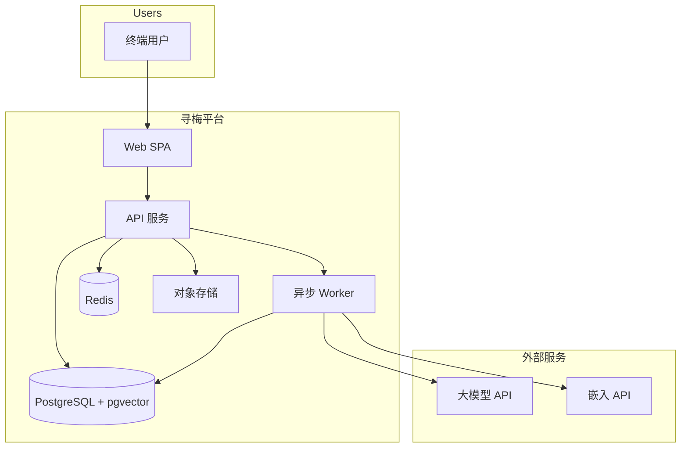
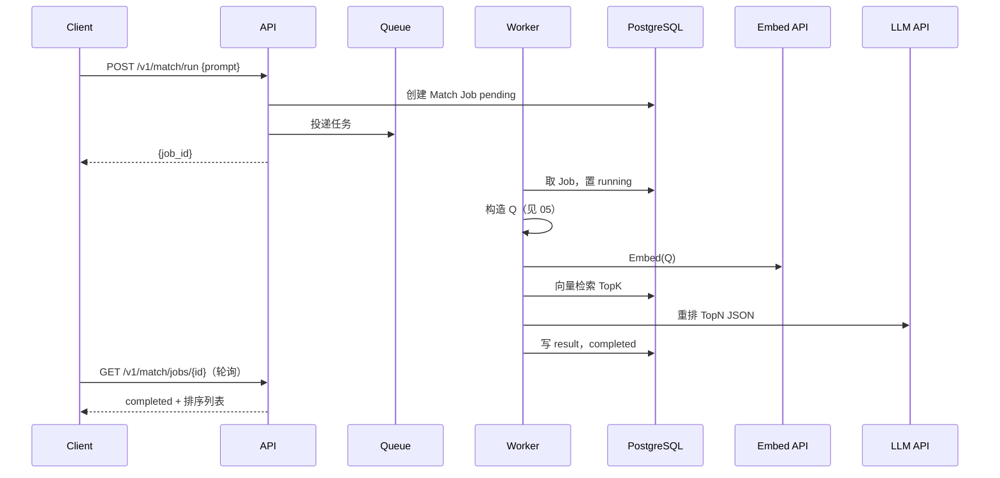

# 寻梅 Seeking Plum — 系统总体架构设计书

| 属性 | 说明 |
|------|------|
| 文档版本 | 0.2 |
| 状态 | 草案（与实现迭代同步） |
| 读者 | 架构师、全栈、运维、产品、用于大模型上下文 |
| 相关文档 | [01-FRONTEND](./01-FRONTEND.md) · [02-BACKEND](./02-BACKEND.md) · [03-SERVER-INFRA](./03-SERVER-INFRA.md) · [04-DATABASE](./04-DATABASE.md) · [05-API-AND-GLOSSARY](./05-API-AND-GLOSSARY.md) |

---

## 1. 文档目的与范围

### 1.1 目的

本设计书描述 **寻梅（Seeking Plum）** 从用户终端到外部 AI 服务的**端到端系统边界、职责划分、数据流与质量属性**，作为：

- 工程实现与代码评审的**顶层约束**；
- 运维与扩容的**上下文依据**；
- 嵌入大模型提示词时的**无歧义架构摘要**来源。

### 1.2 范围（In Scope）

- Web 客户端、API 网关语义、应用服务、异步工作者、关系型数据库与向量检索、缓存/队列、对象存储、第三方 LLM/嵌入服务之间的协作。
- MVP 阶段的**容量假设**与**非功能需求（NFR）**基线。

### 1.3 不在范围（Out of Scope）

- 具体 UI 像素级规范（见 `design/stitch_/celestial_ru/DESIGN.md`）。
- 线下实名、支付、应用商店上架流程。
- 各服务内部函数级设计（见 01～04 分册）。

---

## 2. 业务愿景与核心能力

### 2.1 产品陈述

用户维护**个人简介（长期）**，并随时输入**当次心念 prompt（短期意图）**。系统对二者进行语义理解，在可发现的用户集合中返回**最可能契合的他人 Profile**；在匹配详情中提供 **Echo（回响）**——可读的 AI 契合解读。

### 2.2 核心能力矩阵

| 能力 | 说明 | 主要承担方 |
|------|------|------------|
| 身份与会话 | 注册、登录、令牌 | 后端 API + 基础设施 |
| Profile 管理 | 简介、展示字段、头像 | API + DB + 对象存储 |
| 语义匹配 | 向量召回 + LLM 重排 | Worker + DB(pgvector) + 外部 LLM |
| 契合解读 | Echo 生成与缓存 | Worker + DB + LLM |
| 即时通讯（可选） | Echoes 会话 | API + DB（分阶段） |

---

## 3. 业务与容量假设（固定基线）

以下数值为 **MVP / 成长期** 架构假设；变更时需同步修订 03（部署）与 04（索引策略）。

| 维度 | 假设值 | 架构含义 |
|------|--------|----------|
| 注册用户规模 | 1×10⁴～5×10⁴（首年） | 单机 PostgreSQL + 单 API 实例可承载；向量索引规模可控 |
| 日活占比 | MAU 的 5%～15% | 估算在线并发与读路径 QPS |
| 资料读 QPS | 5～20 | 以缓存友好读模型为主 |
| 匹配请求 | 0.5～3 QPS，峰值按 **3×** 预留 | **慢路径**：必须异步 Job + 可轮询/推送 |
| 单次匹配 P95 延迟 | 8～15s | 含嵌入、向量检索、LLM 重排；前端须 **Zen Loader** 级反馈 |
| 召回 / 重排深度 | 向量 Top **100** → LLM 重排 Top **10**（可调） | 控制成本与上下文长度 |

---

## 4. 系统上下文（C4 Level 1）

**边界说明**

- **Web SPA**：仅通过 HTTPS 调用后端 REST API；静态资源可走 CDN。
- **API 与 Worker**：逻辑分离，共享同一数据库 schema 与领域模型；Worker 独占重计算与外部 AI 调用。
- **Redis**：队列、分布式锁、限流计数、短期会话等（具体键模式见 02/03）。
- **对象存储**：头像等用户媒体；**不**存放主业务事务数据。

---

## 5. 逻辑分层架构

| 层级 | 职责 | 技术归属 |
|------|------|----------|
| 表现层 | 路由、页面、设计系统组件、客户端状态 | 见 [01-FRONTEND](./01-FRONTEND.md) |
| 应用层（同步） | 鉴权、Profile CRUD、触发匹配 Job、Echo 读取入口 | 见 [02-BACKEND](./02-BACKEND.md) |
| 应用层（异步） | 嵌入回填、匹配流水线、Echo 生成 | 同上 |
| 数据层 | 事务一致性、向量索引、缓存 | 见 [04-DATABASE](./04-DATABASE.md) |
| 基础设施 | 容器、网络、密钥、观测 | 见 [03-SERVER-INFRA](./03-SERVER-INFRA.md) |
| 契约与术语 | REST 语义、领域词表、查询文本 Q | 见 [05-API-AND-GLOSSARY](./05-API-AND-GLOSSARY.md) |

---

## 6. 核心数据流：匹配（Match）

**设计要点**

- **异步必然性**：匹配耗时与外部 API 不稳定，禁止在同步请求中阻塞完成整条流水线。
- **可观测**：`job_id` 贯穿日志与指标，便于排障。

---

## 7. 质量属性（NFR）

| NFR | 目标 | 实现要点 |
|-----|------|----------|
| 可用性 | API 月度可用性 ≥ 99%（MVP） | 健康检查、Worker 重启策略、DB 连接池 |
| 性能 | 读路径 P95 &lt; 500ms（不含匹配）；匹配见 §3 | 索引、避免 N+1、分页 |
| 安全 | 传输加密、最小权限、密钥不入库 | TLS、JWT、RLS 策略（演进） |
| 可维护性 | 契约单一事实来源 | OpenAPI + 本文 05 + 分册交叉引用 |
| 可扩展性 | Worker 水平扩展 | 无状态 API、队列竞争消费 |
| 隐私 | prompt/bio 不全量进日志 | 见 02 日志策略 |

---

## 8. 关键架构决策（ADR 摘要）

| ID | 决策 | 理由 |
|----|------|------|
| ADR-001 | 向量检索 + LLM 重排，而非全库两两送 LLM | 成本、延迟与可扩展性 |
| ADR-002 | 匹配异步 Job + 轮询（MVP） | 实现简单；后续可加 SSE/WebSocket |
| ADR-003 | PostgreSQL + pgvector 同库 | 事务与向量一致性运维成本低 |
| ADR-004 | 查询文本 Q 的拼接规则全局唯一 | 见 [05](./05-API-AND-GLOSSARY.md)，保证可复现 |

---

## 9. 风险与缓解

| 风险 | 缓解 |
|------|------|
| 外部 LLM/嵌入 API 限流或故障 | 重试退避、熔断占位文案、队列积压告警 |
| 向量与文本不一致 | bio 变更触发嵌入刷新任务（见 04） |
| 提示词注入与恶意内容 | 输入长度限制、异步审核占位（产品演进） |

---

## 10. 修订记录

| 版本 | 日期 | 说明 |
|------|------|------|
| 0.1 | — | 初稿 |
| 0.2 | — | 扩展为总体架构设计书 |
