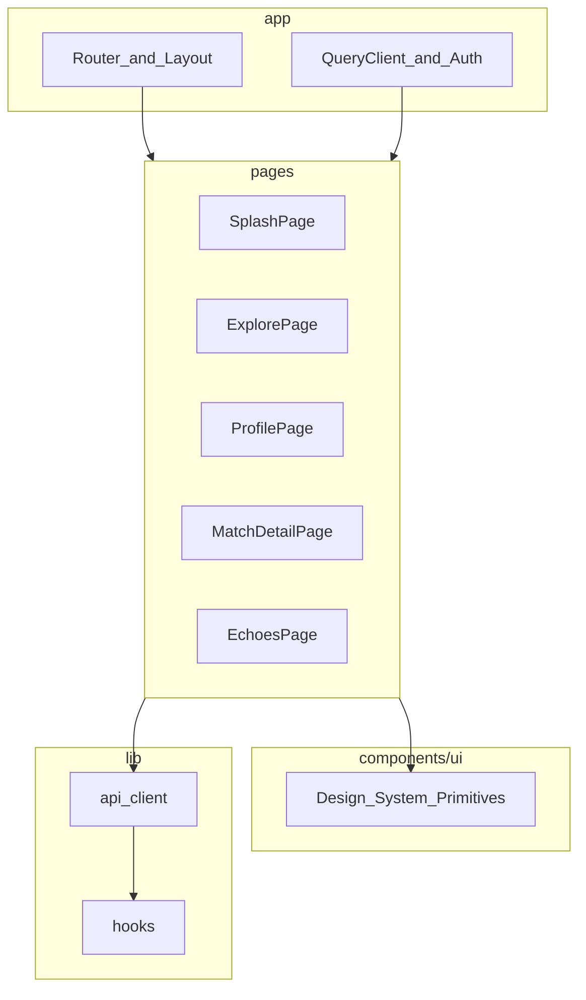

# 寻梅 — 前端系统架构设计书

| 属性 | 说明 |
|------|------|
| 文档版本 | 0.2 |
| 状态 | 草案 |
| 读者 | 前端开发、设计协作、用于大模型上下文 |
| 相关文档 | [00-OVERVIEW](./00-OVERVIEW.md) · [02-BACKEND](./02-BACKEND.md) · [05-API-AND-GLOSSARY](./05-API-AND-GLOSSARY.md) |
| 视觉规范 SSOT | `design/stitch_/celestial_ru/DESIGN.md`（The Ethereal Archive） |

---

## 1. 文档目的与范围

### 1.1 目的

规定 **Web 客户端** 的技术选型、信息架构、与后端的集成方式、状态与错误策略，使 UI 实现与「宋式书院」视觉规范一致，且长期可维护。

### 1.2 范围

- 单页应用（SPA）结构、路由、组件分层、设计令牌落地方式。
- 与 REST API 的交互模式（鉴权、轮询、错误码）。
- 构建、环境变量与前端安全基线。

### 1.3 非范围

- 后端业务规则与数据库结构（见 02、04）。
- HTTP 字段级 JSON Schema（以 OpenAPI 为准，见 05）。

---

## 2. 架构目标与原则

| 原则 | 说明 |
|------|------|
| 单一代码库 SPA | 首版为 Web；路由与领域模型应便于未来迁移至原生壳（不改 API 语义）。 |
| 设计系统单一来源 | Tailwind 主题与全局样式**只维护一份**，禁止从多个 stitch HTML 复制冲突配置。 |
| 契约驱动 | 类型与校验与后端 OpenAPI 对齐；领域术语使用 [05](./05-API-AND-GLOSSARY.md) 中的中英文固定写法。 |
| 慢路径显式反馈 | 匹配等长耗时操作必须使用 **Zen Loader**（慢渐变），禁止仅依赖旋转加载图标。 |

---

## 3. 技术栈（锁定）

| 类别 | 选型 | 说明 |
|------|------|------|
| 语言 / 运行时 | TypeScript strict | 减少契约漂移 |
| 框架 | React 18 | 并发特性、生态 |
| 构建 | Vite | 开发与构建速度 |
| 样式 | Tailwind CSS | theme 对齐 DESIGN.md token |
| 路由 | React Router v6+ | 声明式路由，与信息架构表一致 |
| 服务端状态 | TanStack Query | 缓存、重试、去重、轮询 Job |
| 客户端校验 | Zod | 与 OpenAPI 生成类型配合（推荐 codegen） |
| HTTP | fetch 或 openapi-fetch | 统一 baseURL 与拦截器 |

---

## 4. 信息架构与路由

### 4.1 页面映射（与 stitch 对齐）

| 路径 | 页面职责 | 设计参考 |
|------|----------|----------|
| `/` 或 `/splash` | 品牌首屏、进入探索 | `design/stitch_/logo_splash/` |
| `/explore` | 心念输入、发起寻觅、可选精选入口 | `design/stitch_/_1/`、`search/`（合并为一套路由） |
| `/profile` | 我的资料：编辑/展示简介等 | `design/stitch_/profile/` |
| `/match/:profileId` | 他人资料、Echo、Essence、Connect | `design/stitch_/_2/`、`match_detail/` |
| `/echoes` | 会话列表与聊天（分阶段） | `design/stitch_/echoes_chat/` |

### 4.2 全局导航

- **底栏三 Tab**：**Explore · Echoes · Profile**（英文展示名与 05 术语表一致）。
- 顶栏：品牌「寻梅」、可选菜单与当前用户头像入口（与 stitch 一致）。

---

## 5. 前端逻辑架构（分层）

| 目录 | 职责 |
|------|------|
| `src/app/` | 根布局、路由表、全局 Provider（Query、可选 Theme）。 |
| `src/pages/` | 页面级组合；可含页面私有子组件。 |
| `src/components/ui/` | **无业务含义**的可复用 UI：如 `InkstoneTextarea`、`SealButton`、`ZenLoader`。 |
| `src/lib/api/` | HTTP 封装、`Authorization` 注入、错误体解析（映射到稳定 `code`）。 |
| `src/styles/` | 字体、`selection`、墨水渐变等全局样式。 |

**禁止**：将整页 stitch HTML 单文件粘贴为不可拆分的巨石组件。

---

## 6. 与后端集成

### 6.1 基址与版本

- 所有请求指向 `VITE_API_BASE_URL`，路径前缀 **`/v1`**（见 05）。
- 环境：**仅**使用 `VITE_*` 暴露给浏览器；密钥不得出现在构建产物中。

### 6.2 鉴权

- 使用后端签发的 **Bearer Token**（或项目约定的会话机制）；在 `api` 层统一附加 `Authorization`。
- Token 刷新策略与后端约定一致（若采用 Refresh Token，放在 httpOnly cookie 或安全存储策略由 02 定义）。

### 6.3 匹配 Job 交互模式

1. `POST /v1/match/run` 返回 `job_id`。
2. TanStack Query 对 `GET /v1/match/jobs/{job_id}` 使用 **轮询**，间隔递增退避，直至 `completed` / `failed`。
3. UI：Explore 页展示 **Zen Loader** + 可取消/返回（若产品需要，需后端支持取消则另议）。

### 6.4 Echo 加载

- Match Detail 进入后请求 `GET /v1/profiles/{id}/echo`（语义见 05）；可骨架屏 + 渐进展示。

---

## 7. 错误与空状态

| 场景 | 行为 |
|------|------|
| 4xx 业务错误 | 读取响应体 `code`，映射为简短中文提示；**不**向用户暴露堆栈。 |
| 401 | 引导重新登录或刷新会话。 |
| 429 | 展示限流提示；匹配类与 05 的 `RATE_LIMIT` 对齐。 |
| 5xx | 通用故障文案 + 重试；记录 `request_id`（若响应头提供）便于反馈。 |
| 空列表 | 符合设计系统的留白与竖排文案，避免粗暴弹窗。 |

---

## 8. 性能与体验

- 路由级 **code splitting**（动态 import），首屏仅加载 Splash/Explore 所需。
- 图片：头像使用合适尺寸、懒加载；符合 DESIGN.md「展品式」留白。
- 避免在 render 中发起无去重请求；依赖 TanStack Query 的 `queryKey` 规范。

---

## 9. 可访问性与国际化（基线）

- 语义化标题层级；关键按钮具备可聚焦样式（与「鬼边框」不冲突前提下）。
- 文案：**默认中英可配置**；路由与术语以 05 为准，避免同一概念多种中文混用。

---

## 10. 测试策略（建议）

| 层级 | 工具 | 覆盖 |
|------|------|------|
| 单元 | Vitest + Testing Library | 工具函数、Zod schema、纯组件 |
| 契约 | 可选 Pact / OpenAPI diff | 与后端 CI 对齐 |
| E2E | Playwright | 主路径：登录 → Explore → 匹配结果（可用 mock 服务） |

---

## 11. 修订记录

| 版本 | 说明 |
|------|------|
| 0.1 | 初稿 |
| 0.2 | 扩展为前端架构设计书 |
