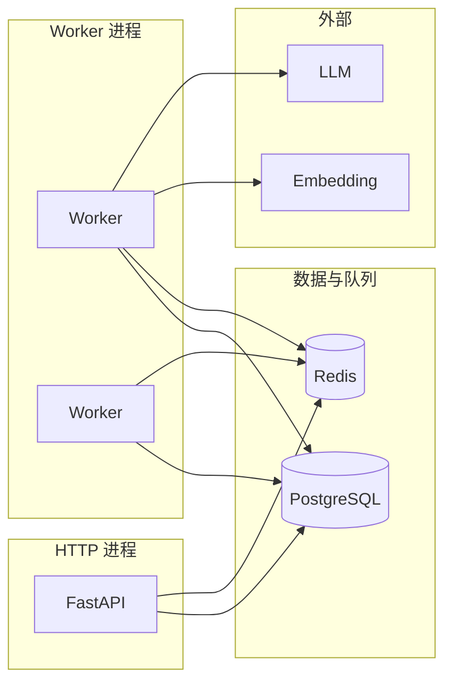

# 寻梅 — 后端系统架构设计书（Python）

| 属性 | 说明 |
|------|------|
| 文档版本 | 0.2 |
| 状态 | 草案 |
| 读者 | 后端开发、SRE、用于大模型上下文 |
| 相关文档 | [00-OVERVIEW](./00-OVERVIEW.md) · [03-SERVER-INFRA](./03-SERVER-INFRA.md) · [04-DATABASE](./04-DATABASE.md) · [05-API-AND-GLOSSARY](./05-API-AND-GLOSSARY.md) |

---

## 1. 文档目的与范围

### 1.1 目的

规定 **Python 应用服务** 与 **异步 Worker** 的分层结构、匹配领域流水线、与外部 AI 的交互方式、配置与观测，保证语义一致、可水平扩展与安全运维。

### 1.2 范围

- FastAPI 同步 API 的职责边界。
- Worker 任务类型、幂等与重试策略（原则级）。
- 嵌入与 LLM 调用的抽象位置；日志与隐私红线。

### 1.3 非范围

- 具体 Prompt 全文（由实现仓库或独立 prompt 管理）；本文只规定**输入输出契约**与**流水线阶段**。
- 容器镜像与端口（见 03）。

---

## 2. 架构目标与原则

| 原则 | 说明 |
|------|------|
| 同步 API 轻量 | 鉴权、校验、CRUD、**投递异步任务**；不阻塞长耗时 AI 调用。 |
| 单一事实来源 | 查询文本 `Q` 的构造规则**仅**在 [05](./05-API-AND-GLOSSARY.md) 定义；代码引用同一实现函数 `build_query_text`。 |
| 无状态 API | 会话外置（JWT/Redis）；便于多副本部署。 |
| 可观测 | 每个请求 `request_id`；匹配 Job 与 `user_id`/`job_id` 关联日志。 |
| 隐私 | **禁止**在日志中完整写入 `prompt` 或 `bio`；可记录 hash 与长度。 |

---

## 3. 技术栈（锁定）

| 组件 | 选型 |
|------|------|
| Web 框架 | FastAPI |
| 异步服务器 | Uvicorn（或等价） |
| 数据访问 | SQLAlchemy 2.x |
| 迁移 | Alembic |
| 校验 | Pydantic v2 |
| HTTP 客户端 | httpx（调用 LLM / Embedding） |
| 异步任务 | Celery + Redis **或** ARQ（二选一，部署见 03） |

---

## 4. 进程模型



- **API 进程**：只处理 HTTP 与 WebSocket（若未来启用）。
- **Worker 进程**：可水平扩展；**不得**假设全局单机锁（除 DB 事务/乐观锁）。

---

## 5. 包与模块结构（约定）

```
backend/app/
  api/                 # 路由：按领域拆分
    auth.py
    profiles.py
    match.py
    health.py
  services/
    matching/          # 领域服务
      pipeline.py      # 编排：run_match_job
      query_text.py    # build_query_text — 唯一实现
      retrieval.py
      rerank.py
      echo.py
    embeddings/
      client.py
      batch.py
  models/              # ORM
  schemas/             # Pydantic 请求/响应
  core/                # 配置、安全、依赖注入
```

---

## 6. 匹配流水线（规范阶段）

以下顺序**不可随意调换**；实现须可通过单元测试与固定种子复现（除 LLM 随机性外）。

| 阶段 | 输入 | 输出 | 说明 |
|------|------|------|------|
| S1 | `requester_id`, `prompt`, 当前 `self_intro` | 查询文本 `Q` | 规则见 [05](./05-API-AND-GLOSSARY.md) |
| S2 | `Q` | 向量 `q_vec` | 调用 Embedding API |
| S3 | `q_vec` | 候选 `profile_id[]`（TopK） | pgvector 余弦相似度，**排除**本人 |
| S4 | 候选摘要文本 | 重排列表（TopN）+ 分数 | LLM 输出 **严格 JSON 数组** |
| S5 | — | 持久化 `match_jobs.result` | 状态 `completed` |
| Echo（独立请求或子任务） | `viewer`, `target`, `prompt_hash` | Echo 结构化 JSON | 读缓存或生成后写入 `echo_cache` |

**LLM 重排输出约束（语义）**

- 必须是**可解析 JSON 数组**，元素含 `profile_id`、`score`（0–100）、`reason_short`（短句）。
- 若解析失败：重试有限次；仍失败则 Job `failed` 并记录 `error_code`（不暴露内部细节给客户端）。

---

## 7. Embedding 回填策略

- **触发条件**：`profiles.bio` 或影响语义的字段变更。
- **执行方**：异步任务，**不**阻塞 `PATCH /profiles/me` 的 HTTP 响应（可先返回 202 或同步返回 + 后台任务，产品需与前端约定）。
- **一致性**：检索时若 `embedding_version` 落后于 `bio` 版本，应拒绝用旧向量参与匹配或排队刷新（实现二选一，须在代码中显式注释）。

---

## 8. API 层职责（同步）

| 路由组 | 职责 |
|--------|------|
| `auth` | 注册、登录、刷新、登出 |
| `profiles` | 当前用户 Profile；公开资料读取 |
| `match` | 创建 Job、查询 Job 状态 |
| `health` | `/health` 存活；`/ready` 依赖 DB |

**限流**

- `POST /v1/match/run`：按**用户 ID** 限流（Redis 令牌桶或固定窗口）；超限返回 429 + `RATE_LIMIT`（见 05）。

---

## 9. 外部服务调用

| 服务 | 用途 | 失败策略 |
|------|------|----------|
| Embedding | `Q` 与 profile 文本向量化 | 指数退避重试；熔断后 Job 失败 |
| LLM | 重排、Echo 生成 | 同上；限制 `max_tokens` 与超时 |

**密钥**：仅从环境变量读取；禁止提交到仓库。

---

## 10. 配置（环境变量，命名约定）

前缀建议 `APP_`（与部署文档一致）：

| 变量 | 含义 |
|------|------|
| `APP_DATABASE_URL` | 异步驱动 URL |
| `APP_REDIS_URL` | 队列与限流 |
| `APP_JWT_SECRET` | 签发密钥 |
| `APP_EMBEDDING_MODEL` | 嵌入模型名 |
| `APP_LLM_MODEL` | 重排/Echo 所用模型 |
| `APP_MATCH_TOPK` / `APP_MATCH_TOPN` | 召回与重排深度 |

---

## 11. 安全

- **HTTPS** 终止在边缘（见 03）；应用层信任 `X-Forwarded-*` 仅在反向代理后。
- **资源所有权**：任何 `profile_id`、`job_id` 必须校验归属。
- **CORS**：仅允许前端域名白名单。

---

## 12. 修订记录

| 版本 | 说明 |
|------|------|
| 0.1 | 初稿 |
| 0.2 | 扩展为后端架构设计书 |
