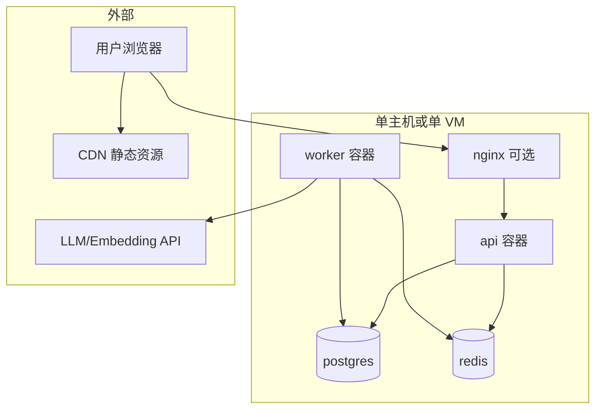

# 寻梅 — 服务器与基础设施架构设计书

| 属性 | 说明 |
|------|------|
| 文档版本 | 0.2 |
| 状态 | 草案 |
| 读者 | 运维、SRE、后端、用于大模型上下文 |
| 相关文档 | [00-OVERVIEW](./00-OVERVIEW.md) · [02-BACKEND](./02-BACKEND.md) · [04-DATABASE](./04-DATABASE.md) |

---

## 1. 文档目的与范围

### 1.1 目的

规定 **运行环境**、**进程与容器**、**网络与 TLS**、**密钥管理**、**观测与健康检查** 的基线，使 MVP 可部署、可监控，并为横向扩展预留空间。

### 1.2 范围

- Docker Compose 单主机拓扑（MVP）。
- 服务间依赖与端口约定。
- 日志、指标、告警的最低要求。

### 1.3 非范围

- 业务表结构与查询（见 04）。
- 应用代码分层（见 02）。

---

## 2. 部署拓扑（MVP）

- **静态前端**：构建产物托管于 **CDN** 或 **nginx 同机**；仅回源 HTML/JS/CSS。
- **API**：内网或经 nginx 反代对外暴露 **443**。

---

## 3. 容器与服务清单

| 服务名 | 镜像职责 | 说明 |
|--------|----------|------|
| `api` | 运行 Uvicorn + FastAPI | 无状态；可 `replicas` 扩展 |
| `worker` | 运行 Celery/ARQ worker | 可水平扩展；与队列消费竞争 |
| `postgres` | PostgreSQL 15+ + pgvector | 持久卷挂载数据目录 |
| `redis` | 队列、限流、缓存 | 持久策略按业务选择（MVP 可 AOF） |
| `nginx` | 可选 | TLS 终止、反向代理、gzip |

---

## 4. 端口与网络约定

| 服务 | 容器内端口 | 对外（示例） | 备注 |
|------|------------|--------------|------|
| api | 8000 | 经 nginx 443 | 变更须同步前端 `VITE_API_BASE_URL` |
| postgres | 5432 | **不**对公网 | 仅 Docker 网络 |
| redis | 6379 | **不**对公网 | 仅 Docker 网络 |

**防火墙**：仅 22（管理）、443（业务）对公网；数据库与 Redis 仅内网。

---

## 5. TLS 与域名

- 生产环境 **HTTPS only**；HTTP 重定向到 HTTPS。
- 证书：Let’s Encrypt 或云厂商托管证书；自动续期。

---

## 6. 密钥与配置管理

| 类型 | 存储方式 | 禁止 |
|------|----------|------|
| `DATABASE_URL`、`REDIS_URL` | 环境变量/密钥管理 | 写入镜像层 |
| LLM/Embedding API Key | 环境变量 | 前端构建与浏览器 |
| `JWT_SECRET` | 环境变量 | 日志与错误响应 |

**配置注入**：12-factor；**不**在仓库中存放生产 `.env`。

---

## 7. 健康检查与就绪

| 端点 | 用途 | 检查内容 |
|------|------|----------|
| `GET /health` | 存活（liveness） | 进程响应即可 |
| `GET /ready` | 就绪（readiness） | PostgreSQL 可达 |

编排系统（Kubernetes 或 Docker healthcheck）应区分二者，避免 DB 抖动时流量误杀。

---

## 8. 观测（Observability）

| 层级 | MVP 要求 | 说明 |
|------|----------|------|
| 日志 | 结构化 JSON：`timestamp`, `level`, `request_id`, `job_id` | 集中收集（如 Loki/CloudWatch） |
| 指标 | QPS、延迟直方图、5xx 率、队列深度 | Prometheus 或云监控 |
| 追踪 | 可选 OpenTelemetry | 跨 API → Worker → DB |

**告警**：Worker 队列积压超阈值、5xx 率、DB 连接失败。

---

## 9. 备份与恢复（基线）

| 数据 | 策略 |
|------|------|
| PostgreSQL | 每日逻辑全量 + WAL/连续归档（按云厂商能力） |
| Redis | 视业务：队列可丢则快照；关键数据应以 PG 为准 |
| 对象存储 | 版本控制或跨区域复制（演进） |

RTO/RPO 目标由产品确认后写入运维手册。

---

## 10. 扩容路径

| 瓶颈 | 动作 |
|------|------|
| 匹配延迟 | 增加 Worker 副本；调 TopK/TopN |
| API QPS | 增加 `api` 副本 + 负载均衡 |
| 数据库 | 读副本、连接池调优；向量索引 HNSW 参数 |
| Redis | 哨兵或集群（演进） |

---

## 11. 修订记录

| 版本 | 说明 |
|------|------|
| 0.1 | 初稿 |
| 0.2 | 扩展为基础设施架构设计书 |
